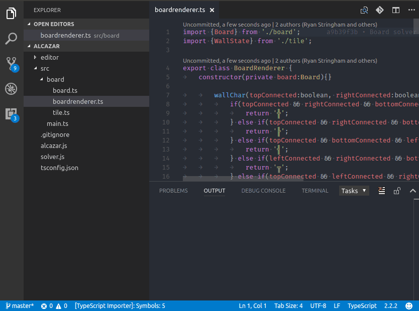

# Move TS README

Supports moving typescript files and updating relative imports within the workspace.

## Features
Moves TypeScript files and folders containing TypeScript and updates their relative import paths.

## How to use



<!--## Extension Settings-->

<!--## Known Issues-->

## Release Notes

## 1.7.0

Improve performance of indexing the workspace.

## 1.6.0

Report progress with vscode's withProgress extension api when indexing the workspace.

## 1.5.0

Added support for `tsconfig.json` CompilerOptions -> paths.

## 1.4.0

Added support for `*.tsx` files.

New configuration option that can limit which paths are scanned: `movets.filesToScan` should be an array of strings and defaults to `['**/*.ts', '**/*.tsx']`

### 1.3.1

Allow initiating moving the current file with a hotkey. To use edit keybindings.json and add:

```json
{
    "key": "ctrl+alt+m",
    "command": "move-ts.move",
    "when": "editorTextFocus"
}
```
### 1.3.0

Support updating relative paths in export statements
### 1.2.0

Support for Windows paths

### 1.1.0

Add `movets.skipWarning` configuration option

### 1.0.0

Initial release of Move TS